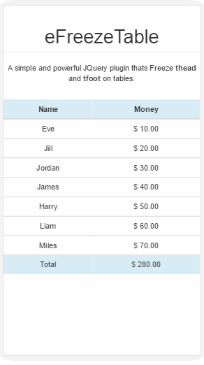

eFreezeTable
=========

A simple and powerful JQuery plugin thats Freeze thead and tfoot on tables.



## Usage

```js
$('#table1').eFreezeTableHead();
$('#table2').eFreezeTableHeadFoot();
```

## Example

eFreezeTable example, included in this repo in the docs directory.

## Contributing

1. Fork it
2. Create your feature branch (`git checkout -b my-new-feature`)
3. Test your changes to the best of your ability.
4. Update the documentation to reflect your changes if they add or changes current functionality.
5. Commit your changes (`git commit -am 'Added some feature'`)
6. Push to the branch (`git push origin my-new-feature`)
7. Create new Pull Request

## Creator

Created and maintained by Eduardo Malherbi.

## License

[MIT License](http://en.wikipedia.org/wiki/MIT_License)
